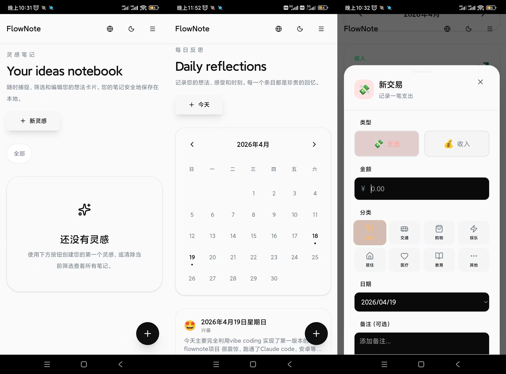

# FlowNote

纯vibe coding项目，效果很不错。正在迭代优化。

一款优雅的本地优先笔记应用，支持灵感记录、每日日记和财务管理。采用现代 Web 技术栈构建，支持 PWA 离线使用，提供流畅的类原生应用体验。

[](https://nextjs.org/)
[](https://react.dev/)
[](https://www.typescriptlang.org/)
[](https://tailwindcss.com/)
[](https://web.dev/progressive-web-apps/)

## 🛠️ 快速开始
你可以直接在Releases中获得当前版本的安装包



## ✨ 功能特性

### 📝 三大核心模块

| 模块 | 功能描述 |
|------|---------|
| **Ideas (灵感)** | 快速记录想法和创意，支持标签分类和筛选 |
| **Journal (日记)** | 日历视图管理每日日记，支持心情标记和富文本 |
| **Finance (财务)** | 收入和支出追踪，分类统计和月度报表 |

### 🎨 界面特性

- **深色/浅色主题** - 自动适配系统偏好，支持手动切换
- **流畅动画** - 基于 Framer Motion 的页面过渡和交互动画
- **响应式设计** - 完美适配桌面端和移动端
- **毛玻璃效果** - 现代感的半透明 UI 设计
- **骨架屏加载** - 优雅的加载状态体验

### 🌍 国际化

- 支持 **中文** 和 **英文** 双语切换
- 默认语言：中文
- 语言偏好自动保存

### 💾 数据存储

- **本地优先**：所有数据存储在浏览器 localStorage
- **隐私安全**：数据完全本地，不上传云端
- **分片存储**：大数据自动分片，避免容量限制

## 🚀 技术栈

### 核心框架
- **[Next.js 15](https://nextjs.org/)** - React 全栈框架，支持 App Router
- **[React 19](https://react.dev/)** - 用户界面库
- **[TypeScript](https://www.typescriptlang.org/)** - 类型安全的 JavaScript
- 安卓部署

### 样式与 UI
- **[Tailwind CSS 4](https://tailwindcss.com/)** - 原子化 CSS 框架
- **[shadcn/ui](https://ui.shadcn.com/)** - 高质量的 React 组件库
- **[Radix UI](https://www.radix-ui.com/)** - 无头 UI 组件基础

### 动画与交互
- **[Framer Motion](https://www.framer.com/motion/)** - 声明式动画库
- **[Sonner](https://sonner.emilkowal.ski/)** - 美观的 Toast 通知

### 主题与国际化
- **[next-themes](https://github.com/pacocoursey/next-themes)** - 主题切换管理
- **自定义 i18n** - 轻量级国际化方案


### 环境要求

- Node.js 18.0 或更高版本
- npm 或 yarn 包管理器

### 安装依赖

```bash
cd app
npm install
```

### 开发模式

```bash
npm run dev
```

应用将在 `http://localhost:3000` 启动，使用 Turbopack 进行快速热更新。

### 构建生产版本

```bash
npm run build
```

构建输出位于 `app/.next` 目录。

### 生产环境运行

```bash
npm start
```

## 📖 使用指南

### 记录灵感

1. 点击右上角 "新灵感" 按钮或右下角浮动按钮
2. 填写标题、内容和标签（用逗号分隔）
3. 点击保存，灵感卡片将显示在列表中
4. 点击标签可筛选相关灵感

### 写日记

1. 进入 Journal 页面，查看日历视图
2. 点击 "今天" 按钮或选择日历日期
3. 选择心情图标，填写日记内容
4. 有记录的日期会在日历上显示标记

### 记账

1. 进入 Finance 页面，切换月份查看收支
2. 点击 "新交易" 选择收入或支出
3. 选择分类（餐饮、交通、工资等）
4. 查看月度统计卡片和交易列表

## ⚙️ 配置说明

### 主题配置

主题通过 `next-themes` 管理，支持：
- `light` - 浅色主题
- `dark` - 深色主题
- `system` - 跟随系统

### 国际化配置

语言文件位于 `app/lib/i18n.tsx`，结构如下：

```typescript
const translations = {
  zh: {
    nav: { ideas: '灵感', journal: '日记', finance: '财务' },
    ideas: { title: '灵感笔记', ... },
    journal: { title: '每日反思', ... },
    finance: { title: '财务管理', ... },
  },
  en: { ... }
}
```

### PWA 配置

PWA 配置在 `app/manifest.ts` 中：

```typescript
export default function manifest(): MetadataRoute.Manifest {
  return {
    name: 'FlowNote',
    short_name: 'FlowNote',
    display: 'standalone',
    // ...
  }
}
```

## 🏗️ 架构设计

### 状态管理

项目采用轻量级状态管理方案：
- **本地状态**：React `useState` 和 `useReducer`
- **持久化状态**：自定义 `localStorage` Hook
- **全局状态**：React Context（主题、语言）

### 组件设计

- **原子化组件**：基于 shadcn/ui 的基础组件
- **页面组件**：每个模块独立的路由页面
- **布局组件**：`FlowShell` 提供统一导航框架

### 动画策略

- **页面级**：`PageTransition` 组件包裹内容区域
- **组件级**：Framer Motion 的 `motion` 组件
- **微交互**：`whileTap`、`whileHover` 手势动画

### 存储策略

```typescript
// 标准存储（小数据）
localStorage.setItem(key, JSON.stringify(data))

// 分片存储（大数据 > 1MB）
storage.setItem(key, data)  // 自动分片
```

## 🔧 开发指南

### 添加新页面

1. 在 `app/app/` 下创建新目录
2. 添加 `page.tsx` 文件
3. 在 `flow-shell.tsx` 的导航数组中添加路由

### 添加新组件

```bash
# 使用 shadcn/ui CLI
npx shadcn add component-name
```

### 添加翻译

1. 打开 `app/lib/i18n.tsx`
2. 在 `translations` 对象的 `zh` 和 `en` 中添加对应键值

### 自定义动画

使用 `page-transition.tsx` 中的组件：

```tsx
import { FadeIn, ScaleOnTap, HoverCard } from '@/components/page-transition'

<FadeIn delay={0.1}>
  <Content />
</FadeIn>

<ScaleOnTap scale={0.95}>
  <Button>Click me</Button>
</ScaleOnTap>
```

## 📱 移动端优化

### 触摸交互

- 最小触摸目标：48px
- 触摸反馈：缩放动画
- 滑动支持：底部抽屉菜单

### 性能优化

- GPU 加速：`transform: translateZ(0)`
- 图片懒加载：Next.js Image 组件
- 代码分割：按路由自动分割

### PWA 配置

- Service Worker：自动生成
- 离线缓存：静态资源和 API 数据
- 添加到主屏：支持 iOS 和 Android

## 🐛 调试技巧

### 查看存储数据

```javascript
// 浏览器控制台
Object.keys(localStorage)
  .filter(k => k.startsWith('flownote-'))
  .forEach(k => console.log(k, localStorage.getItem(k)))
```

### 清除应用数据

```javascript
// 清除所有 FlowNote 数据
storage.clearAll()
```

### 性能分析

```javascript
// 查看存储使用情况
storage.getUsage()
```

## 🤝 贡献指南

1. Fork 项目仓库
2. 创建功能分支：`git checkout -b feature/amazing-feature`
3. 提交更改：`git commit -m 'Add amazing feature'`
4. 推送分支：`git push origin feature/amazing-feature`
5. 创建 Pull Request

## 📄 许可证

开放非商业用途许可，商业用途需作者授权
Grant an open non-commercial usage license. 
For commercial use, authorization from the author is required.

## 🙏 致谢

- [shadcn/ui](https://ui.shadcn.com/) - 优秀的组件库
- [Lucide Icons](https://lucide.dev/) - 精美的图标集
- [Framer Motion](https://www.framer.com/motion/) - 强大的动画库

---

<p align="center">
  Made with ❤️ using Next.js & React
</p>
